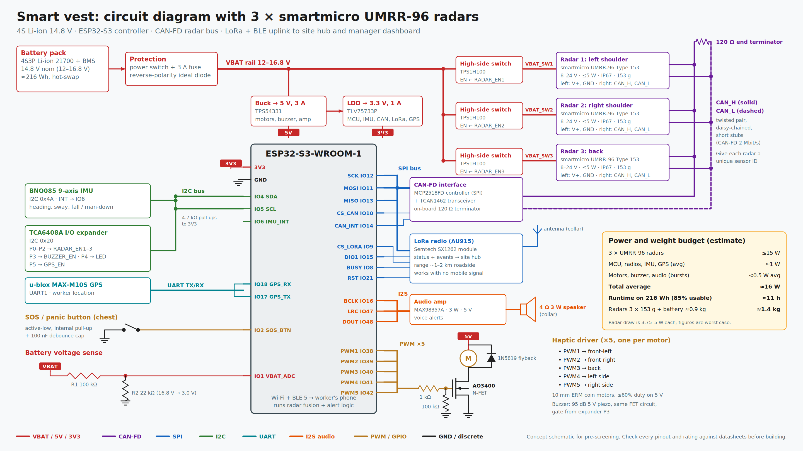

# Smart Safety Kit for Traffic Controllers

**Team She Sustains** · FEIT Hackathon Festival · RPM Hire · Future Work

Traffic controllers (stop/slow baton workers) stand in live traffic for long shifts with limited
situational awareness. This kit helps them in three ways:

1. **Less fatigue:** a stop/go sign on a folding stand, flipped with a foot pedal.
2. **Real-time hazard detection:** a smart vest gives directional vibration, buzzer and voice alerts when a vehicle isn't slowing.
3. **Earlier driver awareness:** an upstream warning sign tells the driver who isn't slowing to slow down, and every event is logged for review.

> **Status:** concept and simulation stage. The hardware hasn't been built yet. The circuit is a
> concept schematic for pre-screening. Check every pinout and rating against the datasheets before building.

## Vest circuit diagram

A scalable vector copy is in [`hardware/vest/vest_circuit.svg`](hardware/vest/vest_circuit.svg).

### How it's wired

- **Power:** a 4S Li-ion pack (14.8 V nominal, 12–16.8 V) with a battery management board, power switch, 3 A fuse and reverse-polarity protection.
  - The radars run straight off the battery rail. Each has its own high-side switch so it can be power-cycled.
  - A 5 V buck converter feeds the motors, buzzer and audio amp.
  - A 3.3 V regulator feeds the logic.
- **Radars:** 3 × smartmicro UMRR-96 Type 153, on one daisy-chained CAN-FD bus.
  - The bus has a 120 Ω terminator at each end.
  - Each radar needs a unique sensor ID.
- **Controller:** an ESP32-S3. It reads the radars through an MCP2518FD CAN-FD controller (SPI) and a TCAN1462 transceiver.
- **Sensors and inputs:** a BNO085 IMU for heading, sway and fall detection, a u-blox MAX-M10S GPS, an SOS button and a battery-voltage divider.
- **Outputs:**
  - 5 coin vibration motors, each driven by its own MOSFET.
  - A 95 dB piezo buzzer.
  - A MAX98357A amplifier driving a 4 Ω speaker for voice alerts.
- **Radio:** an SX1262 LoRa radio (AU915) sends status to the site hub. Built-in Bluetooth connects to the worker's phone as a backup path.

### ESP32-S3 pin map

| Function | GPIO | Notes |
|---|---|---|
| I2C SDA / SCL | 4 / 5 | IMU (0x4A), I/O expander (0x20), 4.7 kΩ pull-ups |
| IMU interrupt | 6 | BNO085 INT |
| SPI SCK / MOSI / MISO | 12 / 11 / 13 | Shared by the CAN-FD controller and the LoRa radio |
| CAN-FD chip select / interrupt | 10 / 14 | MCP2518FD |
| LoRa CS / DIO1 / BUSY / RST | 9 / 15 / 8 / 21 | SX1262 |
| I2S BCLK / LRC / DOUT | 16 / 47 / 48 | MAX98357A |
| Motor PWM 1–5 | 38, 39, 40, 41, 42 | Front-left, front-right, back, left side, right side |
| GPS UART RX / TX | 18 / 17 | UART1 |
| SOS button | 2 | Active-low, internal pull-up, 100 nF debounce |
| Battery sense | 1 (ADC1) | 100 kΩ / 22 kΩ divider (16.8 V → 3.0 V) |

The TCA6408A I/O expander handles the slow signals:

| Pins | Drives |
|---|---|
| P0–P2 | Radar power enables |
| P3 | Buzzer |
| P4 | Status LED |
| P5 | GPS enable |

### Parts list

| Qty | Part | Role |
|---|---|---|
| 3 | smartmicro UMRR-96 Type 153 | 77–81 GHz radar, 8–24 V, ≤5 W, 153 g, IP67 |
| 1 | ESP32-S3-WROOM-1 | Main controller, Wi-Fi + BLE |
| 1 | MCP2518FD + TCAN1462 | CAN-FD interface to the radars |
| 1 | Semtech SX1262 module (AU915) | LoRa link to the site hub |
| 1 | BNO085 | 9-axis IMU |
| 1 | u-blox MAX-M10S | GPS |
| 1 | TCA6408A | I2C I/O expander |
| 3 | TPS1H100 | High-side switch for each radar |
| 1 | TPS54331 | 5 V 3 A buck converter |
| 1 | TLV75733P | 3.3 V 1 A regulator |
| 1 | MAX98357A + 4 Ω 3 W speaker | Voice alerts |
| 5 | 10 mm ERM coin motor + AO3400 + 1N5819 + 1 kΩ + 100 kΩ | Haptic alerts |
| 1 | 95 dB 5 V piezo buzzer + AO3400 | Audible alert |
| 1 | 4S3P 21700 Li-ion pack + 4S BMS | ≈216 Wh, hot-swappable |

### Power and weight budget (estimate)

| Load | Power |
|---|---|
| 3 × UMRR-96 radars | ≤15 W (3.75–5 W each) |
| MCU, radios, IMU, GPS (average) | ≈1 W |
| Motors, buzzer, audio (bursts) | <0.5 W average |
| **Total average** | **≈16 W** |

| Item | Figure |
|---|---|
| Runtime on 216 Wh (85% usable) | **≈11 h** |
| Added weight (radars + battery) | **≈1.4 kg** |

**Known trade-off:** three radars make the vest heavy, which works against the fatigue goal. The
alternative under consideration is to mount one UMRR-96 on the sign stand facing traffic. The vest
would then keep the IMU, alerts and radio.

## Team She Sustains

Members (Alphabetical):

Aniket Wadia\
Jay Shukla\
Khanh Trang Bui\
Sneha Sunil\
Susan Mani\
